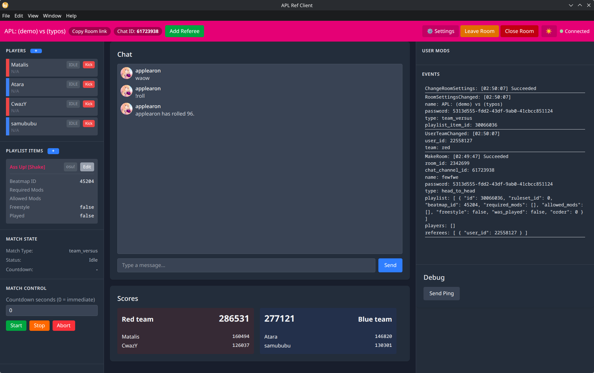

# apl's lazer ref client


## Download
[Releases](https://github.com/applearon/apl-ref/releases/latest)

## Setup
See [SETUP.md](SETUP.md)

## Running

```
npm i
npm start
```

## Compile
```
npm run make -- --platform=win32
```
You can change or omit `-- --platform=win32` depending on what platform you build for. By default, it will build as a bundled zip.

For editing, run this to keep the tailwind css up to date:
```
npx @tailwindcss/cli -i ./src/renderer/css/tailwind-input.css -o ./src/renderer/css/tailwind.css  --watch
```
