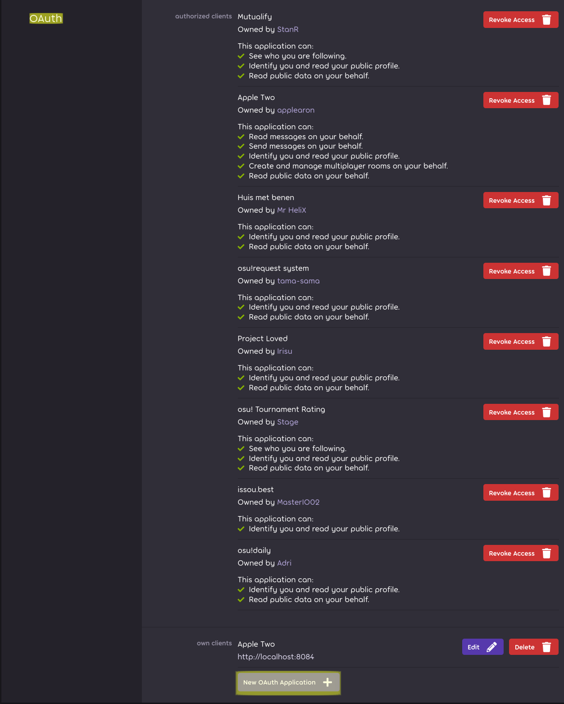
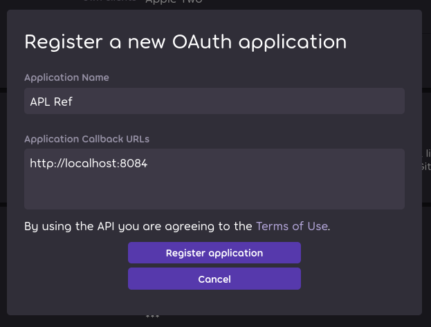
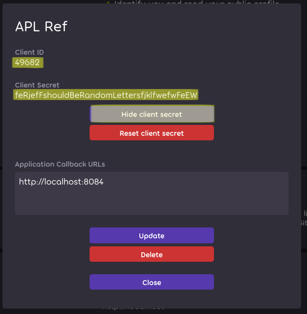
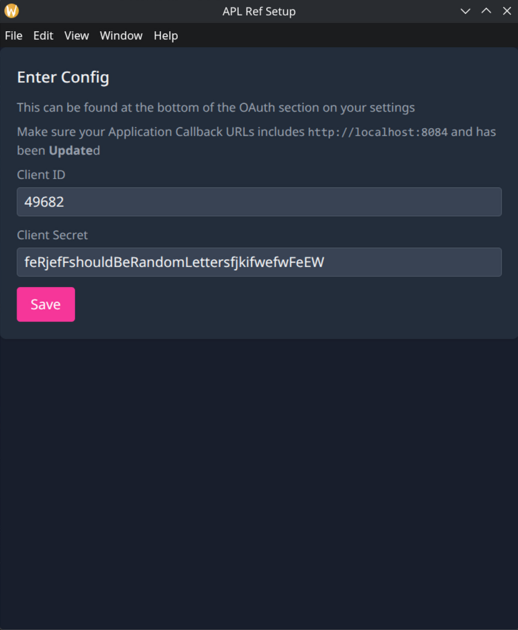

# Obtaining your OAuth Client ID & Secret
1. Go to https://osu.ppy.sh/home/account/edit and scroll to the *bottom* of the **OAuth** section.

2. Click `New OAuth Application` and fill it in as so:

**IMPORTANT:** The most important part is the `http://localhost:8084` in the `Application Callback URLs`, the client name can be whatever you want.
(if you already have an application and wish to use that, you can just click `Edit` instead, just ensure `http://localhost:8084` is in the callback URLs)

3. Click `Show client secret`, and copy the `Client ID` and `Client Secret` into the requisite spots in the config screen on the ref client.

4. Paste in the `Client ID` and `Client Secret` from step 3. into the APL Ref Login Screen.

**Note:** The client may ask you to log into osu! as well for authentication afterwards.

6. You're done!! Every other time you open it, you won't need to copy any OAuth tokens, they're stored on your computer.

If you have any problems, feel free to message me `@applearon` on discord.
